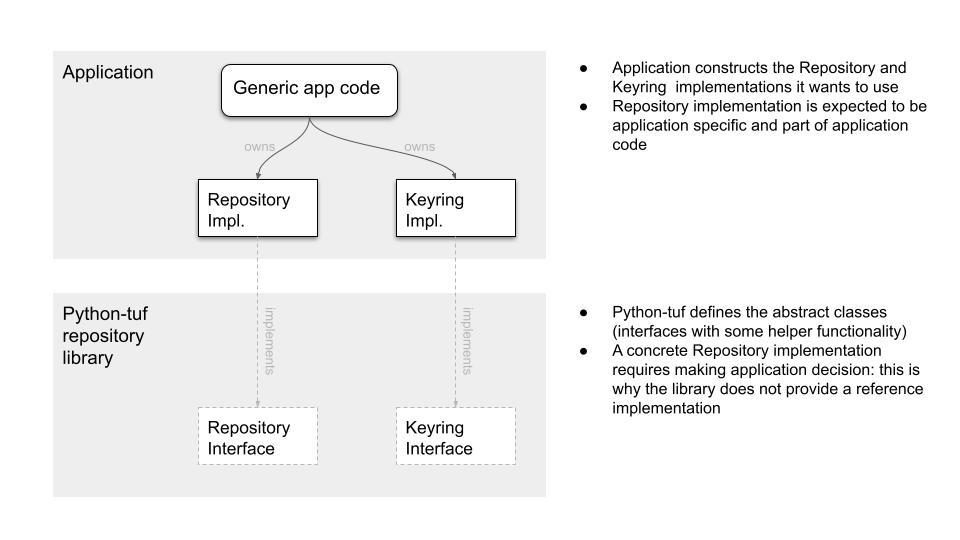
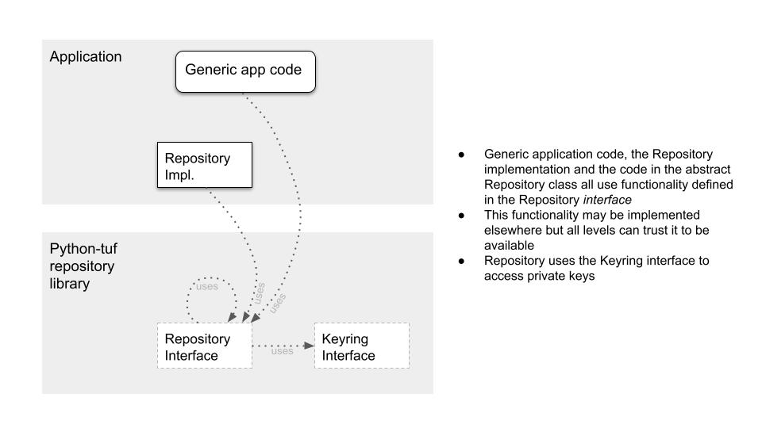

# Python-tuf repository API proposal: _minimal repository abstraction_

This is an attachment to ADR 10: _Repository library design built on top of
Metadata API_, and documents the design proposal in Dec 2021.

## Design principles

Primary goals of this repository library design are
1. Support full range of repository implementations: from command line
   “repository editing” tools to production repositories like PyPI
2. Provide canonical solutions for the difficult repository problems but avoid
   making implementation decisions
3. Keep python-tuf maintenance burden in mind: less is more

Why does this design look so different from both legacy python-tuf code and
other implementations?
* Most existing implementations are focused on a specific use case (typically a
  command line application): this is a valid design choice but severely limits
  goal #1
* The problem space contains many application decisions. Many implementations
  solve this by creating functions with 15 arguments: this design tries to find
  another way (#2)
* The Metadata API makes modifying individual pieces of metadata simpler. This,
  combined with good repository API design, should enable more variance in
  where things are implemented: The repository library does not have to
  implement every little detail as we can safely let specific implementations
  handle things, see goal #3
* This variance means we can start by implementing a minimal design: as
  experience from implementations is collected, we can then move implementation
  details into the library (goals #2, #3)

## Design

### Application and library components



The design expects a fully functional repository application to contain code at
three levels:
* Repository library (abstract classes that are part of python-tuf)
  * The Repository abstract class provides an ergonomic abstract metadata
    editing API for all code levels to use. It also provides implementations
    for some core edit actions like _snapshot update_.
  * A small amount of related functionality is also provided (private key
    management API, maybe repository validation).
  * is a very small library: possibly a few hundred lines of code.
* Concrete Repository implementation (typically part of application code,
  implements interfaces provided by the repository API in python-tuf)
  * Contains the “application level” decisions that the Repository abstraction
    requires to operate: examples of application decisions include
    * _When should “targets” metadata next expire when it is edited?_
    * _What is the current “targets” metadata version? Where do we load it 
      from?_
    * _Where to store current “targets” after editing? Should the previous
      version be deleted from storage?_
* Actual application
  * Uses the Repository API to do the repository actions it needs to do

For context here’s a trivial example showing what “ergonomic editing” means --
this key-adding code could be in the application (or later, if common patterns
are found, in the python-tuf library):

```python
with repository.edit(“targets”) as targets:
    # adds a key for role1 (as an example, arbitrary edits are allowed)
    targets.add_key(key, “role1”)
```

This code loads current targets metadata for editing, adds the key to a role,
and handles version and expiry bumps before persisting the new targets version.
The reason for the context manager style is that it manages two things
simultaneously:
* Hides the complexity of loading and persisting metadata, and updating expiry
  and versions from the editing code (by putting it in the repository
  implementation that is defined in python-tuf but implemented by the
  application)
* Still allows completely arbitrary edits on the metadata in question: now the
  library does not need to anticipate what application wants to do and on the
  other hand library can still provide e.g. snapshot functionality without
  knowing about the application decisions mentioned in previous point.

Other designs do not seem to manage both of these.

### How the components are used



The core idea here is that because editing is ergonomic enough, when new
functionality (like “developer uploads new targets”) is added, _it can be added
at any level_: the application might add a `handle_new_target_files()` method
that adds a bunch of targets into the metadata, but one of the previous layers
could offer that as a helper function as well: code in both cases would look
similar as it would use the common editing interface.

The proposed design is purposefully spartan in that the library provides
very few high-level actions (the prototype only provided _sign_ and
_snapshot_): everything else is left to implementer at this point. As we gain
experience of common usage patterns we can start providing other features as
well.

There are a few additional items worth mentioning:
* Private key management: the Repository API should come with a “keyring
  abstraction” -- a way for the application to provide roles’ private keys for
  the Repository to use. Some implementations could be provided as well.
* Validating repository state: the design is very much focused on enabling
  efficient editing of individual metadata. Implementations are also likely to
  be interested in validating (after some edits) that the repository is correct
  according to client workflow and that it contains the expected changes. The
  Repository API should provide some validation, but we should recognise that
  validation may be implementation specific.
* Improved metadata editing: There are a small number of improvements that
  could be made to metadata editing. These do not necessarily need to be part
  of the repository API: they could be part of Metadata API as well

It would make sense for python-tuf to ship with at least one concrete
Repository implementation: possibly a repo.py look alike. This implementation
should not be part of the library but an example.

## Details

This section includes links to a Proof of Concept implementation in
[repository-editor-for-tuf](https://github.com/vmware-labs/repository-editor-for-tuf/):
it should not be seen as the exact proposed API but a prototype of the ideas.

The ideas in this document map to POC components like this:

| Concept | repository-editor-for-tuf implementation |
|-|-|
| Repository API | [librepo/repo.py](https://github.com/vmware-labs/repository-editor-for-tuf/blob/main/tufrepo/librepo/repo.py), [librepo/keys.py](https://github.com/vmware-labs/repository-editor-for-tuf/blob/main/tufrepo/librepo/repo.py)  |
| Example of repository implementation | [git_repo.py](https://github.com/vmware-labs/repository-editor-for-tuf/blob/main/tufrepo/git_repo.py) |
|Application code | [cli.py (command line app)](https://github.com/vmware-labs/repository-editor-for-tuf/blob/main/tufrepo/cli.py), [keys_impl.py (keyring implementation)](https://github.com/vmware-labs/repository-editor-for-tuf/blob/main/tufrepo/keys_impl.py) |
| Repository validation | [verifier.py (very rough, not intended for python-tuf)](https://github.com/vmware-labs/repository-editor-for-tuf/blob/main/tufrepo/verifier.py)
| Improved Metadata editing | [helpers.py](https://github.com/vmware-labs/repository-editor-for-tuf/blob/main/tufrepo/helpers.py) 


### Repository API

Repository itself is a minimal abstract class: The value of this class is in
defining the abstract method signatures (most importantly `_load`, `_save()`,
`edit()`) that enable ergonomic metadata editing. The Repository class in this
proposal includes concrete implementations only for the following:
* `sign()` -- signing without editing metadata payload
* `snapshot()` -- updates snapshot and timestamp metadata based on given input.
  Note that a concrete Repository implementation could provide an easier to use
  snapshot that does not require input (see example in git_repo.py)

More concrete method implementations (see cli.py for examples) could be added
to Repository itself but none seem essential at this point.

The current prototype API defines five abstract methods that take care of
access to metadata storage, expiry updates, version updates and signing. These
must be implemented in the concrete implementation:

* **keyring()**: A property that returns the private key mapping that should be
  used for signing.

* **_load()**: Loads metadata from storage or cache. Is used by edit() and
  sign().

* **_save()**: Signs and persists metadata in cache/storage. Is used by edit()
  and sign().

* **edit()**: The ContextManager that enables ergonomic metadata
  editing by handling expiry and version number management.

* **init_role()**: initializes new metadata handling expiry and version number.
  (_init_role is in a way a special case of edit and should potentially be
  integrated there_).

The API requires a “Keyring” abstraction that the repository code can use to
lookup a set of signers for a specific role. Specific implementations of
Keyring could include a file-based keyring for testing, env-var keyring for CI
use, etc. Some implementations should be provided in the python-tuf code base
and more could be implemented in applications.

_Prototype status: Prototype Repository and Keyring abstractions exist in
librepo/repo.py._

### Example concrete Repository implementation

The design decisions that the included example `GitRepository` makes are not
important but provide an example of what is possible:
* Metadata versions are stored in files in git, with filenames that allow
  serving the metadata directory as is over HTTP
* Version bumps are made based on git status (so edits in staging area only
  bump version once)
* “Current version” when loading metadata is decided based on filenames on disk
* Files are removed once they are no longer part of the snapshot (to keep
  directory uncluttered)
* Expiry times are decided based on an application specific metadata field
* Private keys can be stored in a file or in environment variables (for CI use)

Note that GitRepository implementation is significantly larger than the
Repository interface -- but all of the complexity in GitRepository is really
related to the design decisions made there.

_Prototype status: The GitRepository example exists in git_repo.py._

### Validating repository state

This is mostly undesigned but something built on top of TrustedMetadataSet
(currently ngclient component) might work as a way to easily check specific
aspects like:
* Is top-level metadata valid according to client workflow
* Is a role included in the snapshot and the delegation tree

It’s likely that different implementations will have different needs though: a
command line app for small repos might want to validate loading all metadata
into memory, but a server application hosting tens of thousands of pieces of
metadata is unlikely to do so.

_Prototype status: A very rough implementation exists in verifier.py : this is
unlikely to be very useful_

### Improved metadata editing

Currently the identified improvement areas are:
* Metadata initialization: this could potentially be improved by adding
  default argument values to Metadata API constructors 
* Modifying and looking up data about roles in delegating metadata
  (root/targets): they do similar things but root and targets do not have
  identical API. This may be a very specific use case and not interesting
  for some applications

_Prototype status: Some potential improvements have been collected in
helpers.py_
